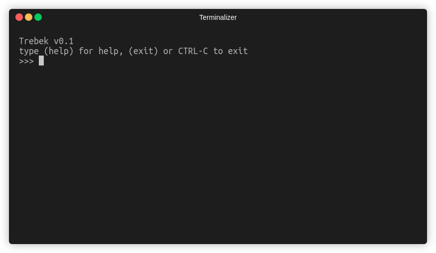

# Trebek
Trebek is a dialect of Lisp, with support for dictionaries, strings and closures. The interpreter is written in Rust.



## Features
- [x] Garbage Collected
- [x] Lexical Scopes
- [x] Closures
- [x] Macros
- [x] Literals expressions (String, List, Dictionary)

### S-expressions
```clojure
>>> (+ 1 2)
3
```

### Literal expressions
```clojure
>>> (let (person {:name "john" :age 32})
...   (print (person :age)))
32
```

### Functions
```clojure
>>> (defn greet (name)
...   (print "Hello " name))

>>> (greet "john!")
"Hello john!"
```

### Iteration
```clojure
>>> (for name ["john", "doe"]
...   (greet name))

"Hello john!"
"Hello doe!"
```


<hr>

### License

Copyright &copy; 2021 Shadman Shadab.

All code is licensed under the MIT. See LICENSE file for details.
